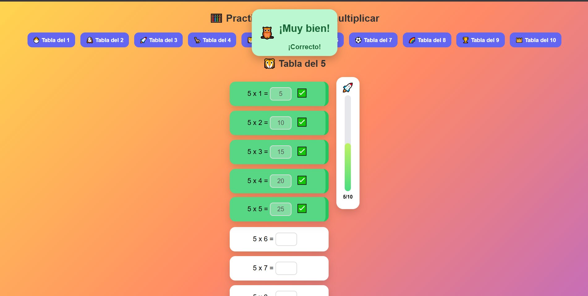

<h1 align="center">🦉 Multiplica con el Búho</h1>

Una pequeña aplicación web desarrollada con <strong>HTML, CSS y JavaScript</strong> para que los niños practiquen las tablas de multiplicar de una forma divertida e interactiva.

---

## 📸 Vista previa

  

---

## 📖 Historia

Este proyecto nació con un objetivo muy especial: crear una herramienta sencilla para que **mi sobrino pudiera practicar las tablas de multiplicar** de una forma más entretenida que una hoja de ejercicios.

Una vez terminado, decidí compartirlo en GitHub por si puede ser útil para alguien más, ya sea para que otro niño practique matemáticas o como ejemplo de un proyecto básico realizado con **HTML, CSS y JavaScript**.

---

## ✨ Características

- 🧮 Tablas de multiplicar del **1 al 10**.
- ✅ Validación inmediata de respuestas.
- 🟢 Retroalimentación visual con colores.
- ✔️ Indicadores de respuesta correcta e incorrecta.
- 🚀 Barra de progreso tipo cohete.
- 🦉 Mensajes motivadores.
- 🏆 Recompensa al completar una tabla.
- 📱 Diseño adaptable a dispositivos móviles.

---

## 🚀 Tecnologías utilizadas

- HTML5
- CSS3
- JavaScript (Vanilla)

---

## 🎯 Objetivo

Además de ayudar a practicar las tablas de multiplicar, este proyecto me permitió seguir practicando conceptos como:

- Manipulación del DOM.
- Eventos en JavaScript.
- Diseño Responsive.
- Flexbox.
- Animaciones y transiciones con CSS.
- Organización de un proyecto Front-End.

---

## 🤝 Contribuciones

Si tienes alguna idea para mejorar el proyecto o agregar nuevas funcionalidades, las contribuciones son bienvenidas.

---

## 📄 Licencia

Sientete libre de usar, comparir y mejorar es solo una base.
